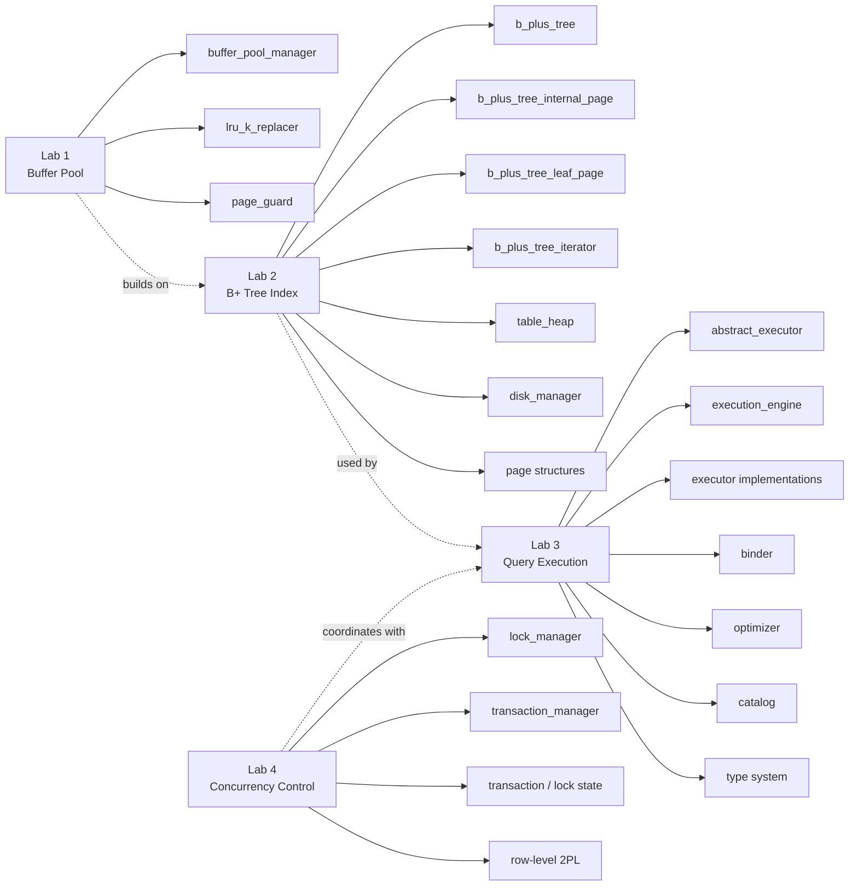

<div align="center">
  
  <h1>OneBase</h1>
  <p><strong>A teaching-oriented relational database system built in modern C++</strong></p>
  <p>
    
    
    
  </p>
</div>

---

## Overview

OneBase is a compact relational database management system designed for teaching core DBMS internals. The project is organized as a sequence of labs that build up a working system from storage to execution and concurrency.

By the end of the project, students will work with:

- Buffer pool management and page replacement
- Disk-backed B+ tree indexing
- SQL binding, planning, and execution
- Transaction locking and two-phase concurrency control

## What You Will Build

The system includes the following major components:

- **Buffer Pool Manager** for caching pages in memory
- **B+ Tree Index** for point lookup and range scan
- **Table Heap** for tuple storage on disk
- **Execution Engine** following the Volcano iterator model
- **Lock Manager** for row-level two-phase locking
- **Binder and Optimizer** for turning SQL into executable plans

## System Architecture

OneBase can be understood in four layers:

- **Storage layer**: disk manager, page layouts, table heap, and B+ tree index
- **Memory layer**: buffer pool manager, LRU-K replacement, and page guards
- **Query layer**: binder, optimizer, execution engine, and executors
- **Concurrency and metadata layer**: lock manager, transaction manager, catalog, and type system

The main execution path is:

1. SQL is parsed and bound into a logical representation.
2. The optimizer produces an executable plan tree.
3. The execution engine runs that plan using executors.
4. Executors read and write tables or indexes through the buffer pool.
5. The buffer pool fetches pages from disk and coordinates with storage structures.

```mermaid
flowchart TD
  SQL[SQL Input] --> Parser[SQL Parser]
  Parser --> Binder[Binder]
  Binder --> Optimizer[Optimizer]
  Optimizer --> Engine[Execution Engine]

  Engine --> Execs[Executors]
  Engine --> Catalog[Catalog]
  Engine --> Txn[Transaction Manager]
  Txn --> Lock[Lock Manager]

  Execs --> TableHeap[Table Heap]
  Execs --> BPT[B+ Tree Index]
  Execs --> Types[Type System]

  TableHeap --> BPM[Buffer Pool Manager]
  BPT --> BPM
  Catalog --> BPM

  BPM --> Guards[Page Guards]
  BPM --> LRUK[LRU-K Replacer]
  BPM --> Pages[Page Structures]
  BPM --> Disk[Disk Manager]
```

## Lab Roadmap

The course is organized into four labs. Each lab builds directly on earlier work.



## Labs

| Lab | Topic | Key Concepts | Main Components |
|-----|-------|--------------|-----------------|
| **1** | [Buffer Pool Manager](docs/lab1_buffer_pool_en.md) | Page caching, eviction, RAII guards | LRU-K Replacer, Buffer Pool Manager, Page Guard |
| **2** | [B+ Tree Index](docs/lab2_b_plus_tree_en.md) | Disk-based indexing, split/merge, iterator | Internal Page, Leaf Page, B+ Tree, Iterator |
| **3** | [Query Execution](docs/lab3_query_execution_en.md) | Volcano model, joins, aggregation, sorting | Executors, Binder, Optimizer, Catalog |
| **4** | [Concurrency Control](docs/lab4_concurrency_control_en.md) | Two-phase locking, compatibility, upgrades | Lock Manager, Transaction Manager |

Each lab includes:

- A written specification in English and Chinese
- Student stub files with `TODO(student)` markers
- Unit tests and evaluation tests

## Quick Start

### Prerequisites

- **Compiler**: GCC 9+ or Clang 10+ with C++17 support
- **CMake**: 3.16 or newer
- **Libraries**: Google Test and `fmt`

Example installation commands:

```bash
# Ubuntu / Debian
sudo apt install cmake g++ libgtest-dev libfmt-dev

# Arch Linux
sudo pacman -S cmake gcc gtest fmt

# macOS
brew install cmake googletest fmt
```

### Build

```bash
mkdir -p build
cd build
cmake ..
cmake --build . -j$(nproc)
```

If `$(nproc)` is unavailable on your system, replace it with a fixed number such as `-j4`.

### Run Tests

Run the full test suite:

```bash
ctest --test-dir build --output-on-failure
```

Run evaluation tests for a specific lab:

```bash
ctest --test-dir build -R lab1_eval_test --output-on-failure
ctest --test-dir build -R lab2_eval_test --output-on-failure
ctest --test-dir build -R lab3_eval_test --output-on-failure
ctest --test-dir build -R lab4_eval_test --output-on-failure
```

Useful development targets:

```bash
ctest --test-dir build -R b_plus_tree --output-on-failure
ctest --test-dir build -R executor_test --output-on-failure
ctest --test-dir build -R lock_manager_test --output-on-failure
```

### Interactive Shell

You can launch the SQL shell after building:

```bash
./build/bin/onebase_shell
```

## Recommended Workflow

For each lab, a reliable workflow is:

1. Read the lab specification in `docs/`.
2. Identify the files with `TODO(student)` markers.
3. Implement incrementally and run the relevant tests frequently.
4. Use `docs/common_mistakes.md` when debugging repeated failures.

In general, it is better to get a minimal correct version working first, then handle edge cases and cleanup.

## Repository Layout

```text
OneBase/
├── src/
│   ├── include/onebase/       # Public headers
│   ├── buffer/                # Lab 1: buffer pool manager
│   ├── storage/               # Lab 2: storage and indexing
│   ├── execution/             # Lab 3: executors and expressions
│   ├── concurrency/           # Lab 4: locking and transactions
│   ├── binder/                # SQL binding
│   ├── optimizer/             # Plan optimization
│   ├── catalog/               # Table and index metadata
│   ├── type/                  # SQL type system
│   └── common/                # Shared utilities
├── test/
│   ├── buffer/                # Unit tests for Lab 1
│   ├── storage/               # Unit tests for Lab 2
│   ├── execution/             # Unit tests for Lab 3
│   ├── concurrency/           # Unit tests for Lab 4
│   └── eval/                  # Evaluation tests
├── docs/                      # Lab specifications and notes
├── tools/                     # Shell and debugging tools
└── third_party/               # External dependencies
```

## Documentation

Lab documents are available in both English and Chinese:

| Lab | English | 中文 |
|-----|---------|------|
| 1 - Buffer Pool | [lab1_buffer_pool_en.md](docs/lab1_buffer_pool_en.md) | [lab1_buffer_pool_zh.md](docs/lab1_buffer_pool_zh.md) |
| 2 - B+ Tree | [lab2_b_plus_tree_en.md](docs/lab2_b_plus_tree_en.md) | [lab2_b_plus_tree_zh.md](docs/lab2_b_plus_tree_zh.md) |
| 3 - Query Execution | [lab3_query_execution_en.md](docs/lab3_query_execution_en.md) | [lab3_query_execution_zh.md](docs/lab3_query_execution_zh.md) |
| 4 - Concurrency Control | [lab4_concurrency_control_en.md](docs/lab4_concurrency_control_en.md) | [lab4_concurrency_control_zh.md](docs/lab4_concurrency_control_zh.md) |

Additional notes:

- [Common Mistakes](docs/common_mistakes.md)

## Submission

Please observe the following submission policies:

1. The deadline for this project is **May 12**. Beginning after May 12, late submissions will incur a score penalty of **20% per day**. The hard deadline is **May 15**. Submissions received after May 15 will not be accepted.
2. At the time of submission, your GitHub repository must be set to **public**. You must submit the repository link to the designated assignment on Canvas.
3. If you used a coding agent during the project, you may include a document named `AGENT_USAGE` in your repository describing how the agent was used for implementation and debugging. This document is optional and will **not** be considered as part of the project evaluation. It will be used only to help improve the course and the project design.
4. All students are expected to uphold academic integrity. Plagiarism is strictly prohibited. Submissions exhibiting excessively high similarity may be subject to additional review.

## Notes

- Build and test in a separate `build/` directory rather than inside `src/`.
- When a test fails, read the first failing assertion carefully before changing code.
- For Lab 2 and later, bugs in earlier labs often propagate upward. If a later lab behaves strangely, recheck earlier components first.
